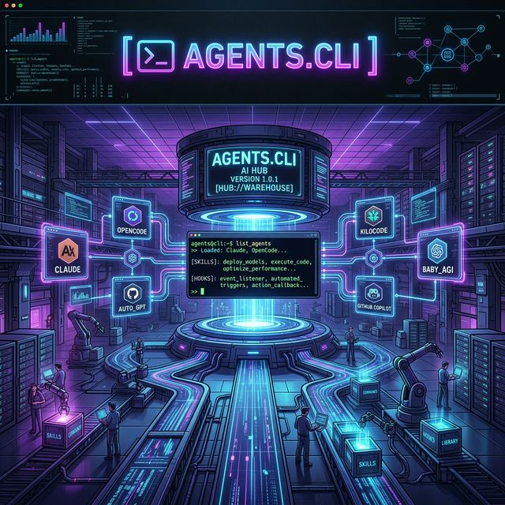

  

  # 🤖 agents.cli

  **The missing layer between you and your AI agents.**

  

---

## 🌟 Overview

**agents.cli** is a documentation and learning hub for AI coding tools - **Claude Code**, **Codex**, **GitHub Copilot**, **Cursor**, **opencode**, and **Pi** - covering the concepts that span all of them: how agents work, permissions, context management, subagents, hooks, MCP servers, and more.

It's a living site: course modules per tool, foundational concepts, and a blog on real-world agentic workflows.

---

## 🚀 What's here

*   🎓 **Course**: step-by-step modules per tool - getting started, sessions & context, permission modes, planning, and more.
*   🧱 **Foundations**: cross-tool concepts (how agents work, rules, subagents, model selection, slash commands, skills, MCP servers).
*   📝 **Blog**: practitioner notes on agentic workflows, session hygiene, and getting more out of AI coding tools.

## 📚 Start here

*   [Course](https://www.agentscli.com/course/)
*   [Foundations](https://www.agentscli.com/foundations/)
*   [Blog](https://www.agentscli.com/blog/)
