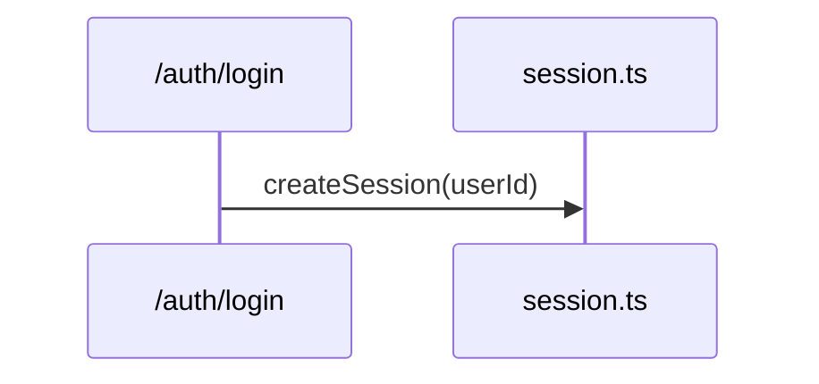
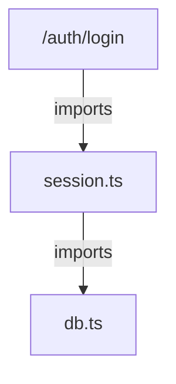
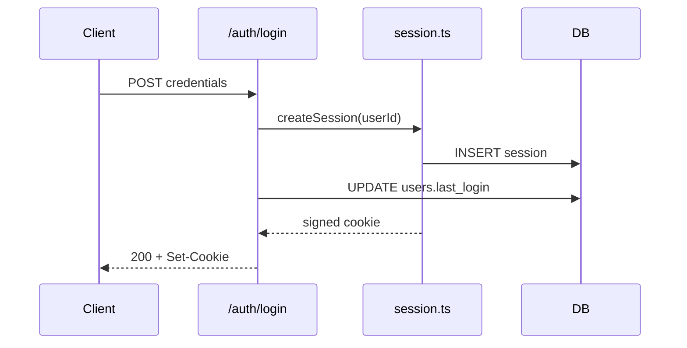

import EdgeAudit from '../../../components/interactive/EdgeAudit.tsx';
import StackDiagram from '../../../components/StackDiagram.astro';
import { Aside, Tabs, TabItem } from '@astrojs/starlight/components';

You're about to edit a service whose shape you don't hold, and the alternative is a morning of grepping and tab-hopping to rebuild the map in your head. An agent can follow every import before you've opened the first file. This play is how you make that speed trustworthy.

| | |
| --- | --- |
| **Use when** | You're about to edit code whose shape you don't hold - inherited, or yours six months ago |
| **You'll have** | A Mermaid diagram, committed as text, answering one question - with the edges your work rests on carrying file-and-line receipts |
| **Costs** | Around twenty minutes, most of it the receipts. The exploration runs itself |
| **Skip if** | The question fits in one file. A diagram of something you can hold in your head is ceremony |

<Aside type="tip" title="In a hurry?">
  ```text
  > generate a Mermaid sequence diagram of how [a specific request] flows
    from [entry point] to [outcome] - explore the actual code first
  ```

  Then, once per edge your work depends on:

  ```text
  > the diagram says X calls Y - show me that call
  ```

  [The receipt](#the-receipt) is where that second line earns the whole page.
</Aside>

## Ask one question

The wrong shape gets you a perfectly valid Mermaid file answering a question you didn't ask: a flowchart of "the login flow" that shows the modules exist but not the order anything happens in.

| Your question | Ask for |
| --- | --- |
| How does a request flow through the system? | `sequenceDiagram` |
| What depends on what? | `graph` (flowchart) |
| What's the data model? | `erDiagram` |
| What states can this thing be in? | `stateDiagram` |

Running example: a login flow in an inherited service. Same subject, two questions, two shapes, and neither is a smaller version of the other.

<Tabs>
  <TabItem label="How does a request flow?">



Temporal order, nothing else: what calls what, when.

  </TabItem>
  <TabItem label="What depends on what?">



The call disappears. What's left is the *static* relationship, true whether or not that function ever runs today.

  </TabItem>
</Tabs>

*Neither diagram is more complete. Each is blind to what the other question doesn't ask. If you need both pictures, ask twice - a hybrid that shows call order and import structure at once is usually harder to read than either alone.*

**Hold onto one fact from the dependency graph:** `/auth/login` imports `session.ts`, but nothing imports `db.ts` except `session.ts` itself. The route file never touches the database module directly. That becomes a second, independent check later, on an edge you haven't seen yet.

**Then scope the ask to that one question, and never to the repo.** "Draw me a diagram" often produces freehand ASCII boxes; "generate a Mermaid diagram" changes the output in kind, into a compact text format a renderer can at least check for validity.

```text
> generate a Mermaid sequence diagram of how a login request flows
  from the /auth/login route to session-cookie issuance
```

The repo-wide ask produces the map you can't trust: either a shallow box-per-folder sketch or, worse because it looks complete, a diagram silently covering only the files the agent read before its [context](/foundations/context-management/) filled, with no warning label on the parts it skipped.

If ASCII art comes back instead of a fenced `mermaid` block, say "Mermaid" explicitly and re-ask. Don't hand-repair a mural.

*Receipt: the prompt names a flow, module, or specific mystery, and it says "Mermaid."*

## The substrate decision

This page is the section's first **capability play** - a play about what you get *out of* an agent, not how you run one. Under the ask sits a decision that outlives every tool named here: **a diagram is words in boxes, so it routes through a text format with a renderer you can pin and verify, never through an image model.**

An image model will happily produce handsome boxes from the same ask. Two things are wrong with that route, and they run on different clocks.

| The objection | Perishable or permanent | What it costs you |
| --- | --- | --- |
| Pixel models garble dense labels - `/auth/login`, `createSession(userId)`, an `https` that must not come back `http` | Perishable. As of mid-2026 it happens often enough that every word needs proofreading. Reports on the newest models disagree about how often; none says never | Proofreading every string in the picture, every time you regenerate |
| Even a flawless render is the wrong artifact | Permanent. No model release fixes this | Everything in the next table |

| | PNG from an image model | Mermaid text |
| --- | --- | --- |
| **Diffable in a PR?** | No | Yes - a reviewer questions an edge the way they'd question a line of code |
| **Greppable against the code?** | No | Yes |
| **Fix one wrong edge?** | Regenerate the whole picture, which redraws things you didn't ask it to touch | A one-line edit. The renderer redraws only what the text says |
| **Reproducible?** | No | Yes, once the renderer version and theme are pinned - same text, same picture |

The text route isn't a workaround for weak image models. It's what makes [the receipt](#the-receipt) possible at all.

<Aside type="note" title="Current picks - dated, mid-2026">
  Mermaid is the default: renderers everywhere, terse enough to review in a diff. [D2](https://d2lang.com/) and Excalidraw's JSON scene format sit in the same category - text in, verifiable picture out - and are fine picks if your team already lives in them. When a new diagramming tool ships, apply the category test rather than chasing the brand: can the agent write the artifact as text, and can your team reproduce and inspect the render?
</Aside>

If the audience needs prettier than a stock render - a slide, a doc leaving the engineering org - stylize downstream instead of switching routes. Keep the Mermaid as the source of truth and hand the *rendered image* to an image model to restyle. Structure and wording are settled in text before any pixels exist, so a garbled label costs a decoration retry, not the map. It still costs a proofread.

## Watch it explore

A diagram worth having is the residue of real reconnaissance: following imports, grepping entry points, reading the router. The same homework you'd have done by hand, compressed into tool calls.

```text
⏵ Grep    "router.post" src/routes/
  →  src/routes/auth.ts:12
⏵ Read    src/routes/auth.ts
⏵ Grep    "createSession" src/
  →  src/services/session.ts:9
⏵ Read    src/services/session.ts
⏵ Grep    "db\." src/services/session.ts
  →  line 18: db.sessions.insert(...)
⏵ Read    src/db/client.ts
⏵ Read    src/routes/auth.ts:28-40
```

That's the whole trail for this flow: six calls touching four files, in the order the request actually moves through them. In Claude Code the exploration can go to the read-only [Explore subagent](/foundations/subagents/); OpenCode's `plan` mode gives the same look-don't-touch posture.

**Now read the trail for what it *doesn't* touch.** Nothing here greps a users table, a `last_login` column, or anything about a second write. That gap isn't proof of anything yet. But an edge with no line anywhere in this trail is exactly the kind about to render just as confidently as the six that do have one.

A diagram that appears *without* a trail came from the model's idea of what codebases like yours usually look like:

<StackDiagram
  caption="both produce a visually identical diagram, and both render without a single Mermaid parser error. Only one of them is evidence."
  messages={[]}
  panels={[
    { title: 'Zero tool calls', rows: [
      { label: '> generate a Mermaid sequence' },
      { label: '  diagram of the login flow' },
      { label: '[diagram appears]' },
    ]},
    { title: 'Full trail', rows: [
      { label: '⏵ Grep  "router.post" src/routes/' },
      { label: '⏵ Read  src/routes/auth.ts' },
      { label: '⏵ Grep  "createSession" src/' },
      { label: '⏵ Read  src/services/session.ts' },
      { label: '⏵ Read  src/db/client.ts' },
      { label: '> generate a Mermaid sequence' },
      { label: '  diagram of the login flow' },
      { label: '[diagram appears]' },
    ]},
  ]}
/>

So demand the reads before you accept a diagram whose transcript has zero tool calls in it. Then stop expecting that to be enough: a full trail lowers the odds of a fabrication without retiring them. The six-call trail above is thorough by exactly this standard, and it still let one invented edge through.

*Receipt: the transcript shows greps and reads touching the files the flow actually crosses - typically a handful, not zero.*

## The receipt

Whatever your tool showed you - inline picture, terminal art, plain code fence - this text is the artifact:



Six edges. Nothing about the render distinguishes the one this pass never explored.

**A rendered diagram radiates authority it hasn't earned.** Rendering only proves the parser could parse it, and a confidently wrong diagram looks *identical* to a correct one. No agent "sees" your codebase as a graph either; there's no internal picture to export, only tokens it can write. The verification is the play; the picture is a by-product.

<EdgeAudit client:visible />

This is where the trust actually comes from, and it's the one part no tool does for you. It's also this section's version of the move every play here repeats: route the agent's claim through a check that can say no. Here that check is an edge receipt against the code.

Pick the two or three edges your upcoming change rests on and demand receipts one at a time - inline, edge by edge, not as a single batch grep at the end where one bad answer hides in a wall of confirmations.

<StackDiagram
  caption="same move, same confidence in the render, opposite answers"
  messages={[]}
  panels={[
    { title: 'The edge you expect to hold', rows: [
      { label: '> the diagram says session.ts calls' },
      { label: '  the DB directly - show me that call' },
      { label: '⏵ Read  src/services/session.ts:14-22' },
      { label: '→ confirmed: line 18,' },
      { label: '  db.sessions.insert(...)' },
    ]},
    { title: 'The edge you have no reason to doubt', rows: [
      { label: '> and it says /auth/login writes' },
      { label: '  users.last_login directly - same ask' },
      { label: '⏵ Grep  "last_login" src/' },
      { label: '→ no matches' },
      { label: '⏵ Grep  "UPDATE users" src/' },
      { label: '→ no matches' },
    ]},
  ]}
/>

The first confirms in one tool call. The second is nothing: two greps, zero matches, and an edge that looked exactly as authoritative as the one beside it right up until you asked.

This is the failure worth naming precisely. Most login flows *do* stamp a last-login timestamp somewhere, so the model reached for the shape it's seen in a thousand training examples instead of the shape actually sitting in this repo. Rendering can't tell the two edges apart. Only the grep can.

**The cross-check you already had.** Back in the dependency graph, `session.ts` was the only importer of `db.ts`, which means `/auth/login` has no path to the database that doesn't run through code that graph already drew. Two pictures of the same system, built from different questions, disagreeing - that disagreement is itself a receipt, and it was available before you typed a single prompt above.

<Aside type="caution" title="A silently deleted edge looks identical to one that was never wrong">
  When a check comes back empty, don't just quietly delete the edge and move on - say out loud (to the agent, in the doc, in the PR description) that this specific claim was checked and found false. Otherwise the next person to regenerate the diagram gets no warning that this exact spot needs a second look.
</Aside>

**A receipt has to survive being handed to someone else.** An onboarding doc or an exec deck breaks the play's economics: you verified the edges, but the reader inherits only the picture. So the receipts travel with the artifact, recorded inline where the next regeneration can't silently drop them:

```text
sequenceDiagram
    SessionSvc->>DB: INSERT session   %% verified: session.ts:18, 2026-07-13
```

A reader who can't run the greps can at least see which edges were checked, when, and which were never claimed to be. For a deck version, this is where the substrate section's stylize-downstream move earns its keep: the verified text is the source of truth, and the image model only decorates it.

Thirty seconds per edge converts the diagram from "plausible summary" to "map I checked." Skip it and you haven't saved the morning, you've moved the surprise to Wednesday, when the code you're editing turns out not to do what the diagram told you it did.

**Four tells that you're trusting the picture instead of the code it claims to describe:**

- The diagram arrived with zero tool calls in the transcript before it.
- An edge got "that looks right" instead of a file and a line.
- The ask was "diagram the codebase," so no edge was ever scoped enough to check.
- It went into shared docs with no date, no owner, and no regeneration path.

*Receipt: each load-bearing edge ends in a file-and-line receipt or a named, checked absence. Never in silence.*

## Then decide its lifespan

The diagram describes the code as of this moment, and nothing anywhere watches for drift. So the honest model is regenerate-on-demand, not maintain-forever, and the only question that matters is how long this one lives.

| How long it lives | What it needs | Who enforces it |
| --- | --- | --- |
| **The session.** A one-off comprehension pass | Nothing. Delete it when you're done - regenerating next month costs one prompt | Nobody, by design |
| **Shared docs.** Onboarding, a wiki, a README | A date, an owner, a named regeneration path, and inline receipts on load-bearing edges | The header below, plus whoever the owner line names |
| **A merge gate.** Load-bearing enough to block a PR | All of the above, plus a check that diffs a fresh regeneration against the committed version | [Headless](/foundations/headless/) CI, not somebody's memory |

**For shared docs**, a four-line header answers "can I still trust this" without anyone opening the code it describes:

```text
<!--
  Diagram: login flow (sequence) - POST /auth/login to session cookie
  Generated: 2026-07-13 by @sanjay
  Source scope: src/routes/auth.ts, src/services/session.ts, src/db/client.ts
  Regenerate: /diagram-refresh, or automatically via ci/check-architecture-docs.sh
-->
```

Whatever your tool calls a saved, reusable prompt - a slash command, a custom command file, a stored template - point it at that same scope line every run, and make it a *diff*, not an overwrite. A diagram that silently replaces itself hides exactly the drift you wanted to see:

```text
# diagram-refresh
Re-explore the files listed in this doc's "Source scope" header. Regenerate
the Mermaid block for the same question stated in "Diagram." Diff the
result against the committed version and report only what changed -
edges added, removed, or relabelled. Don't touch anything outside scope.
```

**For a merge gate**, wire that same regeneration into CI rather than trusting someone to remember it exists:

```bash
# ci/check-architecture-docs.sh - runs when the scoped files change
if git diff --name-only "$BASE_SHA"... | grep -qE 'src/routes/auth.ts|src/services/session.ts'; then
  <tool> --headless "regenerate docs/architecture/login-flow.md per its \
    header's source scope, diff the Mermaid block against the version \
    committed on this branch, and exit 1 if any edge changed without a \
    matching update to this PR's diagram"
fi
```

That check doesn't verify the diagram is *right* - nothing short of the receipts does that. It verifies the diagram hasn't silently drifted from the code it claims to describe, using the commodity headless capability every one of these tools already has, not a bespoke drift detector you maintain. If hand-rolling it sounds like a bigger project than the diagram itself, more than one tool already ships this loop.

A committed diagram without an owner is a liability, not documentation. One owned, current diagram beats a folder of fossils.

*Receipt: the diagram is either deleted, or it carries a date, an owner, and a regeneration path enforced by something other than someone's memory.*

## Scope changes what counts as a receipt

Widen the scope and the receipt changes kind. It never disappears.

| Scope | What counts as a receipt |
| --- | --- |
| **Inside one repo** | A file and a line: `session.ts:18` |
| **Across services** | The contract - the OpenAPI spec, the queue's schema file, the published event type |
| **Code that doesn't exist yet** | Nothing. There's nothing to grep, so the play inverts - see below |

Microservices mean no single checkout can ground every edge, so scope the pass per repo and let the receipts change kind at the boundary. **An inter-service edge with no contract to point at isn't verified, it's folklore** - which is worth discovering before you build on it.

### The inversion: a diagram of code that doesn't exist

As a design artifact the Mermaid is a proposal, and no receipt is possible. So it runs on [TDD's logic](/playbooks/tdd-with-agents/) instead: commit the intended sequence diagram *before* building, then run this page's normal pass against the real code once it exists and diff the two.

The edges that drifted from the proposal are exactly the design decisions that changed silently during implementation - now a reviewable list instead of a surprise.

## Tool support, dated mid-2026

Rendering support is the most volatile fact on this page, so treat every row as dated, not permanent. The "since" column reflects each vendor's own release notes as read mid-2026, not something we bisected - use it to gauge how recently a capability landed, and check the current changelog before you rely on it.

| Tool | Renders Mermaid? | Since | Caveat |
| --- | --- | --- | --- |
| Cursor CLI | Yes - inline ASCII in the terminal: flowchart, sequence, state, class, ER | Early 2026 | `Ctrl+O` toggles rendered vs raw source. The IDE chat panel has been less consistent; trust the CLI if the two disagree |
| GitHub Copilot Chat, in VS Code | Yes - inline, pan and zoom included, no copy-paste round-trip | Mid 2026 | Arrived when VS Code folded its Markdown-preview Mermaid support into core and extended it to chat responses |
| Claude Code, Codex, OpenCode, Pi | No - a fenced code block | - | No renderer in the harness. Active community skills and plugins add ASCII or image rendering, several as a one-line install, but none ships with the tool. Most likely row to be stale by the time you read it |

**Off the shelf.** Before scripting your own regeneration pipeline, try [oh-my-mermaid](https://github.com/oh-my-mermaid/oh-my-mermaid): `npm install -g oh-my-mermaid && omm setup` drops skills into Claude Code, Cursor, or Codex, and `/omm-scan` generates multi-perspective architecture docs - data flow, integrations - as Mermaid with an interactive viewer. Its output is still an unverified map. The edge receipts apply to a generated doc exactly as much as to a one-off ask.

None of this changes where the trust comes from. A renderer is a convenience a tool either has today or is one release away from shipping; the spot-check costs the same thirty seconds per edge whether you're looking at a picture or a wall of text.

## Three things people ask

**Why not just ask for a prose explanation of the flow?** Prose smears its claims. A fluent paragraph can gesture at "the session service persists and returns a cookie" without ever committing to who calls whom, in what order.

A diagram forces every relationship into a discrete, enumerable edge, and discrete edges are what make the receipts possible: you can demand proof for `AuthRoute->>DB` in a way you can't for a well-written sentence. Ask for prose *after* the verified diagram; it'll be prose about edges that survived a grep.

**How big can one diagram get - and can I trust an auto-generated repo-wide map?** One answer covers both: scope by question, not by subsystem. If a diagram needs scrolling, the question was too big.

Five small diagrams that each answer one stated question beat one mural of "the architecture." Each stays verifiable in a couple of receipts, and each regenerates alone when its corner of the code moves. A repo-wide sweep, the scanner above included, is a good *index*: use it to find the seam, then run this page's pass on the seam. Generated is not verified.

**Do image-model diagrams have any place at all?** Two honest ones: decorating a *verified* render for an audience that needs polish, and throwaway conversational sketches where nothing depends on an edge being right. The boundary is dependency. The moment your next edit rests on an edge, that edge needs a receipt, and receipts need text.

## The move that outlives the diagram

The edge-receipt habit outlasts every diagram it was invented for. Demanding a file and a line is the same thirty-second move that turns *any* agent claim - a summary, a dependency list, a "this is safe to delete" - into something checked. And the throwaway economics compound: once regeneration costs one prompt, you stop paying the tax of maintaining architecture docs and start generating the exact map each task needs, fresh, scoped, and verified.

The substrate decision travels furthest of all. Next time an agent needs to produce *any* artifact - a deck, a document, a video - ask the question this play answered for diagrams: what's the text format with a renderer you can pin and verify, so the output can be diffed, checked, and edited instead of regenerated? Whatever tools ship next year, that question will still sort them.
