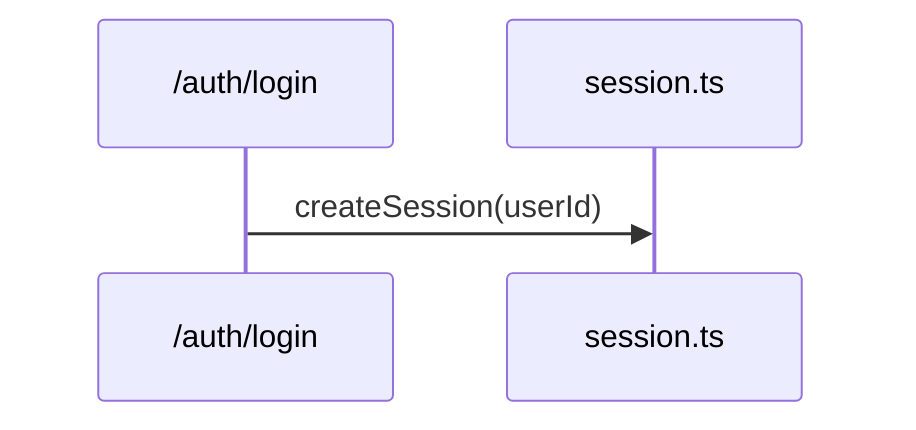
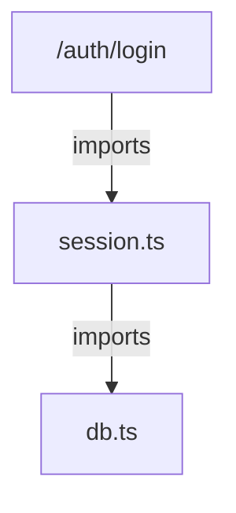
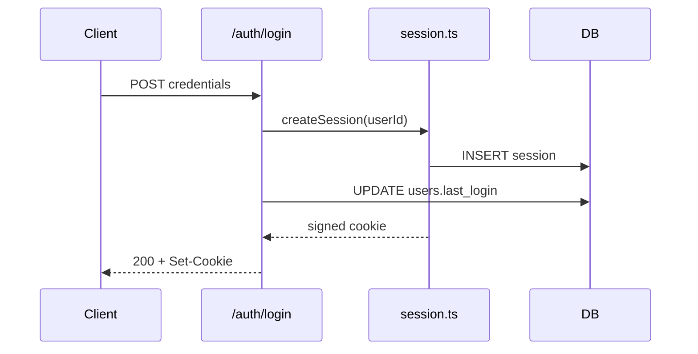

import EdgeAudit from '../../../components/interactive/EdgeAudit.tsx';

**Use this when** you're about to edit code whose shape you don't hold — a service you inherited, one you wrote six months ago, an auth flow and a job queue calling each other in an order nobody wrote down — and the alternative is a morning of grepping and tab-hopping to rebuild the map in your head. The agent can follow every import in the time it takes you to open the first file; this play is how you make its speed *trustworthy*.

**What you'll have when it works:** a Mermaid diagram, as committed text, answering one specific question — with the two or three edges your upcoming work depends on verified against real code, each with a file-and-line receipt. Twenty minutes in, you know which file you're editing first.

## How this works

One constraint drives every step: **a rendered diagram radiates authority it hasn't earned.** Rendering only proves the parser could parse it — a confidently wrong diagram looks *identical* to a correct one. And no agent "sees" your codebase as a graph; there's no internal picture to export, only tokens it can write. So every step below either feeds the diagram real evidence (scoped question, watched exploration) or checks the evidence afterward (edge receipts). The verification is the play; the picture is a by-product.

Here's that constraint made clickable — a clean render with one edge that never existed:

<EdgeAudit client:visible />

## The pass

Running example: a login flow in an inherited service.

**1. Match the diagram type to your question.** The wrong shape gets you a perfectly valid Mermaid file answering a question you didn't ask — a flowchart of "the login flow" that shows the modules exist but not the order anything happens in:

| Question | Ask for |
| --- | --- |
| How does a request flow through the system? | `sequenceDiagram` |
| What depends on what? | `graph` (flowchart) |
| What's the data model? | `erDiagram` |
| What states can this thing be in? | `stateDiagram` |

*Checkpoint: you can state, in one sentence, the question this diagram answers.*

Same subject, two questions, two shapes — and neither is a smaller version of the other. Ask the sequence question about two files from the login flow and you get temporal order, nothing else:



Ask the dependency question about the same two files and the call disappears — what's left is the *static* relationship, true whether or not that function ever runs today:



Notice the dependency graph adds a fact the sequence diagram has no room for: `/auth/login` imports `session.ts`, but nothing imports `db.ts` except `session.ts` itself — the route file never touches the database module directly. Hold onto that; it becomes a second, independent check in step 5, on an edge you haven't seen yet. Neither diagram is "more complete" — each is blind to what the other question doesn't ask. If you need both pictures, ask twice. A single hybrid diagram that tries to show call order *and* import structure at once is usually harder to read than either one alone.

**2. Ask for Mermaid, scoped to that one question — never "diagram the codebase."** "Draw me a diagram" often produces freehand ASCII boxes; "generate a Mermaid diagram" changes the output in kind — a compact text format a renderer can at least check for validity. And the repo-wide ask produces the map you can't trust: either a shallow box-per-folder sketch or, worse because it looks complete, a diagram that silently covers only the files the agent read before its [context](/foundations/context-management/) filled, with no warning label on the parts it skipped.

```text
> generate a Mermaid sequence diagram of how a login request flows
  from the /auth/login route to session-cookie issuance
```

*Checkpoint: the prompt names a flow, module, or specific mystery — not the repo, and it says "Mermaid."*

**3. Watch it explore before it draws.** A diagram worth having is the residue of real reconnaissance — following imports, grepping entry points, reading the router — the same homework you'd have done by hand, compressed into tool calls. A diagram that appears *without* a trail of reads came from the model's idea of what codebases like yours usually look like. In Claude Code the exploration can go to the read-only [Explore subagent](/foundations/subagents/); opencode's `plan` mode gives the same look-don't-touch posture.

```text
⏵ Grep    "router.post" src/routes/
  →  src/routes/auth.ts:12
⏵ Read    src/routes/auth.ts
⏵ Grep    "createSession" src/
  →  src/services/session.ts:9
⏵ Read    src/services/session.ts
⏵ Grep    "db\." src/services/session.ts
  →  line 18: db.sessions.insert(...)
⏵ Read    src/db/client.ts
⏵ Read    src/routes/auth.ts:28-40
```

That's the whole trail for this flow — six calls touching four files, in the order the request actually moves through them. *Checkpoint: the transcript shows greps and reads touching the files the flow actually crosses — typically a handful, not zero.*

Read the trail for what it *doesn't* touch, too: nothing here greps a users table, a `last_login` column, or anything about a second write. Keep that gap in mind — it's not proof of anything yet, but an edge with no line anywhere in this trail is exactly the kind that's about to render just as confidently as the six that do.

**4. Keep the Mermaid source, not the rendering.** However your tool displays it — inline picture, terminal art, plain code fence — the text is the artifact. It goes in a docs file, gets committed, and shows up in a PR diff where a reviewer can question an edge the same way they'd question a line of code:



*Checkpoint: the diagram exists as text in the repo, not as a screenshot pasted into a wiki.*

Six edges, and nothing about the render distinguishes the one this pass never actually explored. That's the point of the next step.

**5. Spot-check the edges your work depends on.** This is where the trust actually comes from, and it's the one step no tool does for you. Pick the two or three edges your upcoming change rests on and demand the receipts one at a time — inline, edge by edge, not as a single batch grep at the end where one bad answer can hide in a wall of confirmations.

Start with the edge you already expect to hold:

```text
> the diagram says session.ts calls the DB directly — show me that call

  ⏵ Read   src/services/session.ts:14-22
  → confirmed: line 18, `db.sessions.insert(...)`
```

Confirmed, in one tool call. Now do the same for the edge you have no particular reason to doubt — it rendered with exactly the same confidence as the first one:

```text
> and the diagram says /auth/login also writes users.last_login directly
  to the DB — show me that call

  ⏵ Grep   "last_login" src/
  → no matches
  ⏵ Grep   "UPDATE users" src/
  → no matches
```

Nothing. Two greps, zero matches, and an edge that looked exactly as authoritative as the one above it right up until you asked. This is the failure worth naming precisely: most login flows *do* stamp a last-login timestamp somewhere, so the model reached for the shape it's seen in a thousand training examples instead of the shape actually sitting in this repo. Rendering can't tell the two edges apart — only the grep can. And if you built the dependency graph back in step 1, you had a second, independent way to catch this before you ever typed the prompt above: that graph showed `session.ts` as the only importer of `db.ts` — `/auth/login` has no path to the database that doesn't run through code the graph already drew. A structural picture and a runtime picture disagreeing is itself a receipt.

When a check comes back empty, don't just quietly delete the edge and move on — say out loud (to the agent, in the doc, in the PR description) that this specific claim was checked and found false. A diagram with a fabrication silently removed looks identical to one that was never wrong, and the next person to regenerate it gets no warning that this exact spot needs a second look.

Thirty seconds per edge converts the diagram from "plausible summary" to "map I checked." Skip it and you haven't saved the morning — you've moved the surprise to Wednesday, when the code you're editing turns out not to do the thing the diagram told you it did. *Checkpoint: each load-bearing edge ends in either a file-and-line receipt or a named, checked absence — never silence.*

**6. Decide its lifespan before you walk away.** The diagram describes the code as of this moment, and nothing anywhere watches for drift. For a one-off comprehension pass, delete it when you're done — regenerating next month costs one prompt.

If it's going into shared docs, give it three things a stale diagram can't fake: a date, an owner, and a named regeneration path. A four-line header answers "can I still trust this" without anyone having to open the code it describes:

```text
<!--
  Diagram: login flow (sequence) — POST /auth/login to session cookie
  Generated: 2026-07-13 by @sanjay
  Source scope: src/routes/auth.ts, src/services/session.ts, src/db/client.ts
  Regenerate: /diagram-refresh, or automatically via ci/check-architecture-docs.sh
-->
```

Whatever your tool calls a saved, reusable prompt — a slash command, a custom command file, a stored template — point it at that same scope line every run, and make it a *diff*, not an overwrite; a diagram that silently replaces itself hides exactly the drift you wanted to see:

```text
# diagram-refresh
Re-explore the files listed in this doc's "Source scope" header. Regenerate
the Mermaid block for the same question stated in "Diagram." Diff the
result against the committed version and report only what changed —
edges added, removed, or relabelled. Don't touch anything outside scope.
```

For a diagram load-bearing enough to gate a merge, wire that same regeneration into [headless](/foundations/headless/) CI instead of trusting someone to remember it exists:

```bash
# ci/check-architecture-docs.sh — runs when the scoped files change
if git diff --name-only "$BASE_SHA"... | grep -qE 'src/routes/auth.ts|src/services/session.ts'; then
  <tool> --headless "regenerate docs/architecture/login-flow.md per its \
    header's source scope, diff the Mermaid block against the version \
    committed on this branch, and exit 1 if any edge changed without a \
    matching update to this PR's diagram"
fi
```

That check doesn't verify the diagram is *right* — nothing short of step 5 does that. It verifies the diagram hasn't silently drifted from the code it claims to describe, using the same commodity headless capability any of these tools already has, not a bespoke drift detector you have to maintain. (If hand-rolling that script sounds like a bigger project than the diagram itself, skip ahead to *Off the shelf* — more than one tool already ships this loop.) *Checkpoint: the diagram is either deleted, or it carries a date, an owner, and a regeneration path enforced by something other than someone's memory.*

## When not to use it

If the question fits in one file, read the file — a diagram of something you can hold in your head is ceremony. And don't reach for this expecting an always-current architecture doc: nothing watches drift, so the honest model is regenerate-on-demand, not maintain-forever. A committed diagram without an owner is a liability, not documentation.

## Failure modes

**The freehand mural.** Boxes assembled character by character, misaligned, flattened into a top-to-bottom list even when the relationships it found are right. *Tell: ASCII art instead of a fenced `mermaid` block. Fix: say "Mermaid" explicitly; re-ask, don't hand-repair.*

**The confident hallucination.** A clean, valid, rendered diagram of a codebase the agent barely read. *Tell:* the two transcripts below produce visually identical diagrams — the only difference is what happened before the render:

```text
> generate a Mermaid sequence diagram of the login flow

  [diagram appears — no tool calls in between]
```

```text
⏵ Grep    "router.post" src/routes/
⏵ Read    src/routes/auth.ts
⏵ Grep    "createSession" src/
⏵ Read    src/services/session.ts
⏵ Read    src/db/client.ts
> generate a Mermaid sequence diagram of the login flow

  [diagram appears]
```

Both render without a single wavy Mermaid parser error. Only one of them is evidence. *Fix:* demand the reads before you accept a diagram whose transcript has zero tool calls in it ("explore the actual routes first, then draw") — and don't stop there, because a full trail lowers the odds of a fabrication without retiring it. Run step 5 on every edge you care about regardless of how thorough the exploration looked; the trail in step 3 was thorough by this same standard and still let one invented edge through.

**The official stale map.** A diagram someone committed eight months ago, still shaping decisions because it renders nicely in the README. *Tell: no date, no owner, and an edge that contradicts the code. Fix: step 6 — date it, own it, or delete it.*

## Off the shelf

Before scripting your own regeneration pipeline, try [oh-my-mermaid](https://github.com/oh-my-mermaid/oh-my-mermaid) (as of mid-2026): `npm install -g oh-my-mermaid && omm setup` drops skills into Claude Code, Cursor, or Codex, and `/omm-scan` generates multi-perspective architecture docs — data flow, integrations — as Mermaid with an interactive viewer. Its output is still an unverified map: step 5's edge receipts apply to a generated doc exactly as much as to a one-off ask.

## What renders where

The pass is identical everywhere; what differs is whether you're looking at a picture or a code fence while you run it. Rendering support is the most volatile fact on this page, so treat every claim below as dated, not permanent:

- **Cursor's CLI** renders Mermaid code blocks as inline ASCII diagrams directly in the terminal — flowcharts, sequence, state, class, and ER — since its Feb 18, 2026 release; `Ctrl+O` toggles between the rendered diagram and the raw source. Its IDE chat panel has been less consistent about this at points — treat the CLI as the reliable surface if the two disagree.
- **GitHub Copilot Chat**, running inside VS Code, picked up native Mermaid rendering when VS Code 1.121 shipped in May 2026: the editor folded its Markdown-preview Mermaid support into core and extended it to chat responses, so a diagram Copilot writes renders inline — pan and zoom included — without a copy-paste round-trip to an external viewer.
- **Claude Code, Codex, opencode, and Pi hand back a fenced code block by default**, with no renderer built into the harness itself, as of mid-2026. Each has an active community ecosystem of skills and plugins that add ASCII or image rendering on top — several install as a one-line plugin entry or a slash command — but none of it ships with the tool. Treat this row as the one most likely to be stale by the time you read it; check your version before assuming the fence is your ceiling.

None of this changes where the trust comes from. A renderer is a convenience a tool either has today or is one release away from shipping; the spot-check in step 5 is the verification, and it costs the same thirty seconds per edge whether you're looking at a picture or a wall of text.

## What compounds

The edge-receipt habit outlives the diagrams: "show me that call" is the same thirty-second move that turns *any* agent claim — a summary, a dependency list, a "this is safe to delete" — into something checked. And the throwaway economics compound in your favor: once regeneration costs one prompt, you stop paying the tax of maintaining architecture docs and start generating the exact map each task needs, fresh, scoped, and verified.
